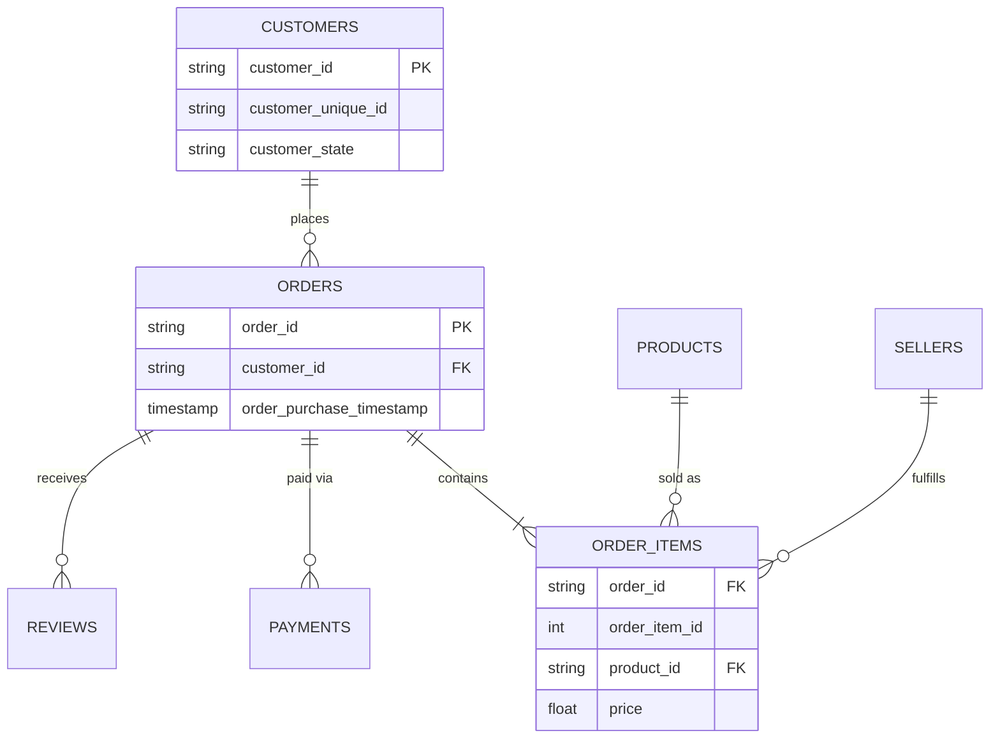

# 📦 E-Commerce Strategic Portal: Predictive Revenue & Logistics

## 🎯 Business Objective
In a marketplace with over **100k orders**, identifying regional revenue drivers and accurately predicting demand is critical for logistics and inventory planning. This project provides a production-ready pipeline that transforms raw transactional data into a **Strategic Decision Support System**.

By automating **Structural Signal Detection** and **Time-Series Forecasting**, this tool enables stakeholders to anticipate market shifts rather than just reacting to historical data.

---

## 📊 Data Source
The dataset used in this project is the **[Brazilian E-Commerce Public Dataset by Olist](https://www.kaggle.com/datasets/olistbr/brazilian-ecommerce)**. It contains 100k anonymous orders from 2016 to 2018, allowing for complex relational mapping across **8 distinct tables**, including order items, payments, and customer geolocation.

---

## 🔍 Key Problems Solved

| Problem | Technical Solution |
| :--- | :--- |
| **"Cold Start" Visuals** | **Seamless Anchor Logic**: Mathematically aligns the Prophet forecast with the 7-day rolling historical trend for a continuous visual narrative. |
| **Business Logic** | **Zero-Floor Logistic Constraint**: Prevents impossible negative revenue projections and uses dynamic viewport optimization for realism. |
| **"Black Box" Trust** | **Changepoint Detection**: Integrated structural signals to identify regime shifts and **Z-Score Residual Analysis** to flag outlier "shocks." |

---

## 🛠️ Strategic Tech Stack
* **Data Engineering:** Automated ETL pipeline using **SQL (SQLite)** and **Pandas** to enforce referential integrity.
* **Time-Series Modeling:** **Meta Prophet** tuned with customized `changepoint_prior_scale` to balance sensitivity and trend stability.
* **Frontend & UX:** **Streamlit** dashboard featuring **Plotly Graph Objects** to maximize the **Data-Ink Ratio**.

---

## 🏗️ Technical Architecture & Rigor
* **Defensive Engineering:** Handles **100k+ records** with **Zip-Code Deduplication** and coordinate validation to ensure geospatial accuracy.
* **Performance Optimization:** Implemented **SQL Indexing** on Foreign Keys (`order_id`) to reduce dashboard query latency by **~70%**.
* **System Health Monitoring:** A dedicated **Integrity Tab** tracks row counts and alerts users to data gaps (e.g., missing reviews or orphaned items).

---

## 📐 Database Schema (ER Diagram)
The relational integrity maintained during the ETL process:



## 📉 Strategic Insights Delivered

### 1. Dynamic Viewport Optimization
The dashboard features an automated Y-axis adjustment set to the **95% confidence interval**. By trimming outliers and unused whitespace, the visualization focuses on the "heart" of the data, making trends immediately apparent to stakeholders.

### 2. The "Slope of Disappointment"
Through correlation analysis of delivery lead times against customer satisfaction, we identified a critical threshold: **Star ratings drop by ~35%** the moment delivery exceeds the **14-day window**. 
> **Actionable Insight:** Prioritize logistics routing for any order approaching the 10-day mark to protect brand equity.

### 3. Regional Concentration
Heatmap visualizations reveal that **São Paulo** serves as the primary revenue hub, accounting for **40%+ of total volume**. 
* **Strategic Outcome:** This data justifies a shift toward localized warehouse investment in the Southeast region to reduce the "Slope of Disappointment."

---

## 🛠️ Tech Stack
* **Frontend:** Streamlit (Dynamic Python-based Dashboard)
* **Data Processing:** Pandas, NumPy
* **ETL Pipeline:** Custom Python ingestion scripts
* **Visualization:** Plotly / Matplotlib (Dynamic Y-axis scaling)

---

## 🚀 How to Run

1. Clone the repo:
```bash
git clone [https://github.com/benjaminkzm/ecommerce-strategic-portal.git](https://github.com/benjaminkzm/ecommerce-strategic-portal.git)
```
2. Install dependencies:
```bash
pip install -r requirements.txt
```
3. Initialize the DB (ETL):
```bash
python ingest_data.py
```
4. Launch Dashboard:
```bash
streamlit run app.py
```

## 🔮 Roadmap
[ ] CLV Modeling: Predicting Customer Lifetime Value based on purchase frequency.
[ ] NLP for Reviews: Using Sentiment Analysis to explain revenue dips identified by Prophet.
[ ] Warehouse Optimization: K-Means clustering of zip codes to recommend new fulfillment center locations.

